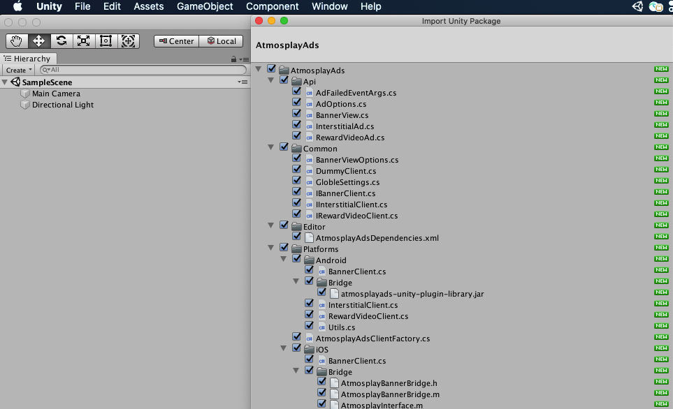

[See the English Guide](https://github.com/Atmosplay/AtmosplayAds-Unity/wiki)

# 入门指南

本指南适用于希望通过 Unity 应用获利的发布商。  

要展示 Atmosplay 广告并赚取收入，第一步是将 Atmosplay 广告 Unity 插件集成到应用中（本页将介绍如何进行此项操作）。  
完成集成后，您可以选择一种广告格式，如原生广告或激励视频广告，以获取详细的植入步骤。  

## 前提条件  

- 在 iOS 上部署  
  - Xcode 10 或更高版本  
  - iOS 8.0 或更高版本  
  - [CocoaPods](https://guides.cocoapods.org/using/getting-started.html)  

- 在 Android 上部署
  - 定位到 Android API 级别 14 或更高级别  

- [Demo](https://github.com/Atmosplay/AtmosplayAds-Unity)

## 下载移动广告 Unity 插件  

借助 Atmosplay 移动广告 Unity 插件，Unity 开发者无需编写 Java 或 Objective-C 代码，即可轻松地在 Android 和 iOS 应用上投放 Google 移动广告。  
该插件提供了一个 C# 界面，用于请求 Unity 项目中 C# 脚本使用的广告。

请通过如下链接下载该插件的 Unity 软件包，或在 GitHub 上查看其代码。

[下载插件](https://github.com/Atmosplay/AtmosplayAds-Unity/releases/download/3.0.0/AtmosplayAds.unitypackage)  
[查看源代码](https://github.com/Atmosplay/AtmosplayAds-Unity)  

### 导入移动广告 Unity 插件

在 Unity 编辑器中打开您的项目，然后依次选择 Assets > Import Package > Custom Package，并找到您下载的 AtmosplayAds.unitypackage 文件。  


确保选择所有文件，然后点击 Import。

  

### 加入移动广告 SDK  

Atmosplay 移动广告 Unity 插件随 Unity Play [服务解析器库](https://github.com/googlesamples/unity-jar-resolver)一起发布。 此库旨在供需要访问 Android 特定库（例如 AAR）或 iOS CocoaPods 的所有 Unity 插件使用。它为 Unity 插件提供了声明依赖项的功能，然后依赖项会被自动解析并复制到 Unity 项目中。

请按照下列步骤操作，确保您的项目包含移动广告 SDK。  

#### 部署到 iOS   

您无需执行其他步骤即可将移动广告 SDK 加入 Unity 项目中。  
*注意：iOS 依赖项的标识是通过 CocoaPods 完成的，而 CocoaPods 是构建过程完成后的一个运行步骤。*  

#### 部署到 Android  

在 Unity 编辑器中，依次选择 Assets > Play Services Resolver > Android Resolver > Resolve。  
Unity Play 服务解析器库会将声明的依赖项复制到 Unity 应用的 Assets/Plugins/Android 目录中。  

*注意：Atmosplay 移动广告 Unity 插件依赖项位于 Assets/AtmosplayAds/Editor/AtmosplayAdsDependencies.xml 中*  

  

# Ad Format
## 横幅  
### 创建 BannerView

```c#
using System;
using UnityEngine;
using AtmosplayAds.Api;
using AtmosplayAds.Common;
public class AtmosplayAdsDemoScript : MonoBehaviour
{
#if UNITY_ANDROID
  const string AtmosplayAds_App_ID = "Your_AtmosplayAds_App_ID_Android";
  const string AtmosplayAds_AdUnit_ID = "Your_AtmosplayAds_AdUnit_ID_Android";
#elif UNITY_IOS
  const string AtmosplayAds_App_ID = "Your_AtmosplayAds_App_ID_iOS";
  const string AtmosplayAds_AdUnit_ID = "Your_AtmosplayAds_AdUnit_ID_iOS";
#else
  const string AtmosplayAds_App_ID = "unexpected_platform";
  const string AtmosplayAds_AdUnit_ID = "unexpected_platform";
#endif

BannerView bannerView;

  void Start() 
  {
    BannerViewOptions bannerOptions = new BannerViewOptionsBuilder()
            .setAdPosition(AdPosition.BOTTOM)
            .setChannelID(GlobleSettings.GetChannelId)
            .setBannerSize(BannerAdSize.BANNER_AD_SIZE_320x50)
            .Build();

    bannerView = new BannerView(AtmosplayAds_App_ID, AtmosplayAds_AdUnit_ID, bannerOptions);
    bannerView.OnAdLoaded += HandleBannerAdLoaded;
    bannerView.OnAdFailedToLoad += HandleBannerAdFailedToLoad;
    bannerView.OnAdClicked += HandleBannerClicked;
  }
#region Banner callback handlers

    public void HandleBannerAdLoaded(object sender, EventArgs args)
    {
        print("===> HandleBannerAdLoaded event received");
    }

    public void HandleBannerAdFailedToLoad(object sender, AdFailedEventArgs args)
    {
        print("===> HandleBannerAdFailedToLoad event received with message: " + args.Message);
    }

     public void HandleBannerClicked(object sender, EventArgs args)
    {
        print("===> HandleBannerClicked event received.");
    }

#endregion
}
```  

### 请求横幅广告

```c#
if (bannerView != null)
{
    bannerView.LoadAd();
}
```  

### 隐藏横幅

```c#
if (bannerView != null)
{
    bannerView.Hide();
}
```

### 展示横幅

```c#
if (bannerView != null)
{
    bannerView.Show();
}
``` 

### 销毁横幅 

```c#
if (bannerView != null)
{
    bannerView.Destroy();
    bannerView = null;
}
```  

## 插屏  

### 创建插屏对象  

```c#
using System;
using UnityEngine;
using AtmosplayAds.Api;
using AtmosplayAds.Common;
public class AtmosplayAdsDemoScript : MonoBehaviour
{
#if UNITY_Android
  const string AtmosplayAds_App_ID_Interstitial = "Your_AtmosplayAds_App_ID_Interstitial_Android";
  const string AtmosplayAds_AdUnit_ID_Interstitial = "Your_AtmosplayAds_AdUnit_ID_Interstitial_Android";
#elif UNITY_IOS
  const string AtmosplayAds_App_ID_Interstitial = "Your_AtmosplayAds_App_ID_Interstitial_iOS";
  const string AtmosplayAds_AdUnit_ID_Interstitial = "Your_AtmosplayAds_AdUnit_ID_Interstitial_iOS";
#else
  const string AtmosplayAds_App_ID_Interstitial = "unexpected_platform";
  const string AtmosplayAds_AdUnit_ID_Interstitial = "unexpected_platform";
#endif

  InterstitialAd interstitial;

  void Start() 
  {
    AdOptions adOptions = new AdOptionsBuilder()
      .SetChannelId("")
      .SetAutoLoadNext(true)
      .build();

    interstitial = new InterstitialAd(AtmosplayAds_App_ID_Interstitial, AtmosplayAds_AdUnit_ID_Interstitial, adOptions);
    interstitial.OnAdLoaded += HandleInterstitialLoaded;
    interstitial.OnAdFailedToLoad += HandleInterstitialFailedToLoad;
    interstitial.OnAdStarted += HandleInterstitialStart;
    interstitial.OnAdClicked += HandleInterstitialClicked;
    interstitial.OnAdClosed += HandleInterstitialClosed;
  }
  
  #region Interstitial callback handlers
  public void HandleInterstitialLoaded(object sender, EventArgs args)
  {
    print("===> HandleInterstitialLoaded event received");
  }
  public void HandleInterstitialFailedToLoad(object sender, AdFailedEventArgs args)
  {
    print("===> HandleInterstitialFailedToLoad event received with message: " + args.Message);
  }
  public void HandleInterstitialStart(object sender, EventArgs args)
  {
    print("===> HandleInterstitialStart event received.");
  }
  public void HandleInterstitialClicked(object sender, EventArgs args)
  {
    print("===> HandleInterstitialClicked event received.");
  }
  public void HandleInterstitialClosed(object sender, EventArgs args)
  {
    print("===> HandleInterstitialClosed event received.");
  }
  #endregion
}
```  

### 请求插屏  

```c#
interstitial.LoadAd(AtmosplayAds_AdUnit_ID_Interstitial);
```

### 判断插屏是否准备好  

```c#
interstitial.IsReady(AtmosplayAds_AdUnit_ID_Interstitial)
```

### 展示插屏  

```c#
if(interstitial.IsReady(AtmosplayAds_AdUnit_ID_Interstitial))
{
  interstitial.Show(AtmosplayAds_AdUnit_ID_Interstitial);
}
```  

## 激励视频  
### 创建激励视频对象  

```c#
using System;
using UnityEngine;
using AtmosplayAds.Api;
using AtmosplayAds.Common;
public class AtmosplayAdsDemoScript : MonoBehaviour
{
#if UNITY_ANDROID
  const string AtmosplayAds_App_ID_Rewarded = "Your_AtmosplayAds_App_ID_Rewarded_Android";
  const string AtmosplayAds_AdUnit_ID_Rewarded = "Your_AtmosplayAds_AdUnit_ID_Rewarded_Android";
#elif UNITY_IOS
  const string AtmosplayAds_App_ID_Rewarded = "Your_AtmosplayAds_App_ID_Rewarded_iOS";
  const string AtmosplayAds_AdUnit_ID_Rewarded = "Your_AtmosplayAds_AdUnit_ID_Rewarded_iOS";
#else
  const string AtmosplayAds_App_ID_Rewarded = "unexpected_platform";
  const string AtmosplayAds_AdUnit_ID_Rewarded = "unexpected_platform";
#endif

  RewardVideoAd rewardVideo;

  void Start() 
  {
    AdOptions adOptions = new AdOptionsBuilder()
      .SetChannelId("")
      .SetAutoLoadNext(true)
      .build();

    rewardVideo = new RewardVideoAd(AtmosplayAds_App_ID_Rewarded, AtmosplayAds_AdUnit_ID_Rewarded, adOptions);
    rewardVideo.OnAdLoaded += HandleRewardVideoLoaded;
    rewardVideo.OnAdFailedToLoad += HandleRewardVideoFailedToLoad;
    rewardVideo.OnAdStarted += HandleRewardVideoStart;
    rewardVideo.OnAdClicked += HandleRewardVideoClicked;
    rewardVideo.OnAdRewarded += HandleRewardVideoRewarded;
    rewardVideo.OnAdClosed += HandleRewardVideoClosed;
  }

  #region RewardVideo callback handlers
  public void HandleRewardVideoLoaded(object sender, EventArgs args)
  {
    print("===> HandleRewardVideoLoaded event received");
  }
  public void HandleRewardVideoFailedToLoad(object sender, AdFailedEventArgs args)
  {
    print("===> HandleRewardVideoFailedToLoad event received with message: " + args.Message);
  }
  public void HandleRewardVideoStart(object sender, EventArgs args)
  {
    print("===> HandleRewardVideoStart event received.");
  }
  public void HandleRewardVideoClicked(object sender, EventArgs args)
  {
    print("===> HandleRewardVideoClicked event received.");
  }
  public void HandleRewardVideoRewarded(object sender, EventArgs args)
  {
    print("===> HandleRewardVideoRewarded event received.");
  }
  public void HandleRewardVideoClosed(object sender, EventArgs args)
  {
    print("===> HandleRewardVideoClosed event received.");
  }
  #endregion
}  
```

### 请求激励视频 

```c#
rewardVideo.LoadAd(AtmosplayAds_AdUnit_ID_Rewarded);
```

### 判断激励视频是否准备好  

```c#
rewardVideo.IsReady(AtmosplayAds_AdUnit_ID_Rewarded)
```

### 展示激励视频  

```c#
if(rewardVideo.IsReady(AtmosplayAds_AdUnit_ID_Rewarded))
{
  rewardVideo.Show(AtmosplayAds_AdUnit_ID_Rewarded);
} 
```